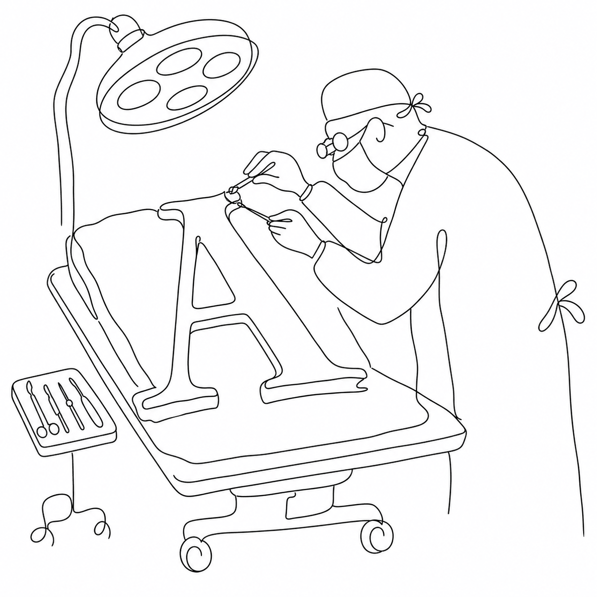

# FontSurgery

**FontSurgery** was the banner Adam Twardoch used for font-hacking work — the idea of putting a typeface on the operating table and repairing it glyph by glyph.

This repository is a **placeholder**. It holds the name and the `www.fontsurgery.com` pointer, nothing more. The scripts that actually lived under this banner are in a separate repository:

- **[fontsurgery-tools](https://github.com/twardoch/fontsurgery-tools)** — macOS scripts that install a font-development toolchain (fontTools, fontmake, harfbuzz, ttfautohint, and more) in one double-click. Archived 2017, but still a useful reference.

## Status

Dormant. There is no code here — only this README and an MIT `LICENSE`. If you arrived looking for the tools, follow the link above. If `www.fontsurgery.com` no longer resolves, assume the project has moved on.

## License

MIT — see [LICENSE](LICENSE).

— Adam Twardoch